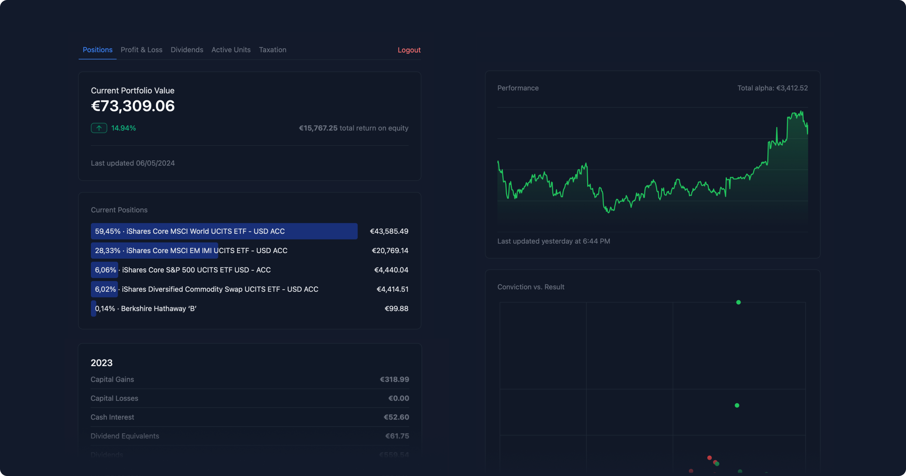

# Doughbox

## What is this?

Doughbox is a self-hosted portfolio tracker. It lets you import various brokerage statements (more on supported brokers below), stores them all in a unified format in a Postgres instance and then displays you various stats on your portfolio, either via CLI or web interface (which can also be used as PWA on your phone).

If you need to take care of capital gains taxes in Austria, you can use Doughbox to help you prepare your tax declaration. Beware that I'm not a tax advisor and I take no responsibility for the outcome — you're responsible for your taxes, so: read the code, do your own research and consult a professional tax advisor.



## Features

- Self-hosted, with a Docker image for easy deployment.
- Web interface, CLI and API.
- Support for FX conversions and trades in non-Euro currencies with FX rates from the ECB.
- Imports brokerage statements from various brokers, e.g. Trade Republic, Revolut, Trading 212, etc.
- Displays Portfolio Allocation across brokerage accounts.
- Displays returns over time for the portfolio and individual positions (both open and closed).
- Displays past dividends.
- Go back in time and view your portfolio's holdings over time.
- If a FRED (Federal Reserve Economic Data of the St. Louis Federal Reserve Bank) token is set, it also gives you a naive (e.g. no fees or taxes considered) benchmark against the S&P 500.
- Fetches stock split data from polygon.io (hence, you will need an API token from Polygon).
- (Naive, optional) password authentication for login to the web interface. Multi-user support is not planned for now.
- Each transaction is assigned an ID either based on the ID from the broker or, if that isn't available, a combination of transaction characteristics. Thus, reimporting the same brokerage statement will not cause duplicate entries.
- It can give you a capitals gains overview, using perpetual WAC and separating FX gains/losses from capital gains/losses with Austrian capital gains tax rates (i.e. 25% for cash interest, 27.5% for capital gains at the time of writing).

## (Known) Limitations

- EUR as base currency — it supports trades in other currencies, but the base currency needs to be EUR.
- Current quotes for securities are not fetched automatically. They're kept in a separate table and need to be refreshed either manually or via API (more on this below).
- Doughbox uses ISINs as primary identifier, so it's agnostic to the trading venue an instrument was bought. If it encounters a ticker symbol during the import, it attempts to convert it to an ISIN via the OpenFIGI API
- Crypto, Real Estate, Cash Holdings aren't supported. Basically, if it has an ISIN, it _might_ work with Doughbox, if it hasn't, then it sure won't.
- PDFs and CSV that are successfully imported are deleted to leave the input folder uncluttered, so please only copy files into the input folder.
- The web interface is currently used for visualizations only, commands need to be invoked using the CLI.

## Supported brokers

| Broker               | Equities & ETFs | Bonds         | Derivatives   | Interest      | FX conversions |
| -------------------- | --------------- | ------------- | ------------- | ------------- | -------------- |
| Revolut              | ✅              | ⚠️ Might work | n.a.          | ⚠️ Might work | ✅             |
| Trade Republic       | ✅              | ✅            | ✅            | ✅            | n.a.           |
| Scalable             | ✅              | n.a.          | ⚠️ Might work | ❌            | n.a.           |
| Erste Bank / George  | ✅              | ⚠️ Might work | ⚠️ Might work | n.a.          | ❌             |
| Wise                 | n.a.            | n.a.          | n.a.          | ✅            | ✅             |
| Interactive Brokers  | ✅              | ✅            | ✅            | n.a.          | ✅             |
| Lightyear            | ✅              | n.a.          | n.a.          | ✅            | ✅             |
| Trading 212 (Invest) | ✅              | n.a.          | n.a.          | ✅            | ✅             |

## Why does this exist?

Doughbox is scratching my own itch: I have lots of different brokerage accounts and I wanted an easy way to stay on top of my portfolio allocation and its performance. While there are great portfolio tracking apps out there (Delta, Finanzfluss Co-Pilot, Parqet, Quin), I wanted to have full control over the data and the supported brokers. And when the need for some custom visulations and capital gains tax preparation came about, I started developing Doughbox. Since I use a lot of open source, self-hosted services, it makes sense for me to open source my personal infrastructure, too.

## Get Started

In order for Doughbox to run, you need a running Postgres instance and a polygon.io API key.

### Docker

```bash
  docker run -d \
  -e POSTGRES_URL="your_postgres_url_here" \
  -e POLYGON_TOKEN="your_polygon_token_here" \
  -p 8084:8084 \
  -v /path/to/your/input-directory:/app/input \
  -v /path/to/your/output-directory:/app/output \
  ghcr.io/alxjpzmn/doughbox:latest
```

Once the app runs, the Web UI will be available. If you've also set an environment variable for `API_TOKEN`, you can use the API too.

First, you need to import your trades. To do so, move your brokerage statements (PDF or CSV, depending on the broker) into a folder. Please beware that Doughbox doesn't work with nested folders yet, so place all files directly inside the input folder. Then run `./doughbox import foldername`.

If you run Dougbox inside Docker, the directory path needs to correspond to to the path inside the container, so `./input`. The full command for importing then becomes: `docker container exec -i doughbox ./doughbox import ./input`. The first import will likely be a bit slower than subsequent ones, since Doughbox will fetch historic FX rates.

After the first import, you will be prompted to run housekeeping and some portfolio and PL calculations, unless you called the import command with `--silent`. Especially on the first run it's highly recommended to run at least `housekeeping` (which will e.g. fetch data on past stock splits based on your holdings).

The web interface will be available per default on port `8084`.

You can run the following commands in the CLI:

`housekeeping`: for fetching stock split data, tax data for funds and ETFs from the Austrian Control Bank (OeKB) and updated FX rates from the ECB.

`portfolio`: to show your current holdings and their allocation in the terminal.

`pl`: this takes a while to run and calculates your return for the portfolio as such and each present and past position within it. It also benchmarks it against the S&P 500 if you've set a FRED API Token. Once you've run it, it will also be shown in the web interface.

`taxation`: also takes a while to run and will output your realized gains and losses, dividends, interest etc. using perpetual WAC. It will also display dividend aequivalents using OeKB data and withholding tax calc using Austrian tax rates and withheld tax from brokerage statements.

`api`: the command to run the web server that serves both the web frontend and the API. The docker container automatically runs this.

## Playbooks

### Trade Republic bulk import

Trade Republic doesn't support any bulk export or direct, documented API access currently. Luckily, there's a great tool to bulk download all of your statements: https://github.com/pytr-org/pytr. Once you've downloaded all of your statements, you can then import the PDF files (e.g. in `Abrechnung` or `Sparplan`) by copying them into the `input` folder of Doughbox.

### Fetch current prices

Since Doughbox doesn't have any direct way to fetch current asset prices (if you know a good free API for asset prices with good European coverage, please let me know), you'll need to either update them manually when you want to check your current portfolio value or you automate it by using the `/api/active_units` endpoint to fetch your current holdings, then fetch the current EUR price for the respective ISIN from a data source and update the `instruments` table accordingly.

### Manual imports

For manual imports of trades, you can create a CSV with the following structure, place it in the `input` folder and import it:

| date                    | broker | ISIN           | avg_price_per_unit | eur_avg_price_per_unit | no_units | direction   | security_type                | currency_denomination | fees | withholding_tax | withholding_tax_currency |
| ----------------------- | ------ | -------------- | ------------------ | ---------------------- | -------- | ----------- | ---------------------------- | --------------------- | ---- | --------------- | ------------------------ |
| 2019-10-29 14:37:45.123 | VSOP   | USXXXXXXXXXXXX | 10.231             | 9.123                  | 10       | Buy \| Sell | Equity \| Bond \| Derivative | EUR \| USD \| ....    | 0.0  | 0               | EUR \| USD \| ...        |

## Acknowledgments

As Carl Sagan put it: "If you want to bake an Apple Pie, you must first invent the universe from scratch". In that spirit, Doughbox simply cobbles together a bunch of excellent open source libraries and existing tools. Here's a non-exhaustive list:

- Rust, JavaScript & React
- Tremor, an excellent UI Library built on top of Tailwind
- Tokio and axum
- Postgres
- SWR
- Vite

## Disclaimer

I don't take responsibility for any tax implications, financial losses or similar as a result of using Doughbox. Please check the code and do your own research before using it.
